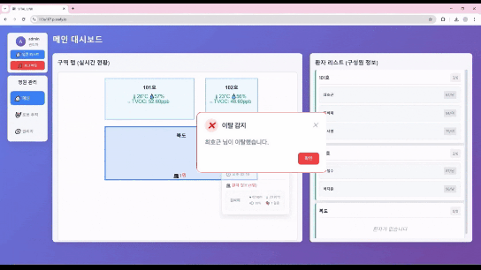
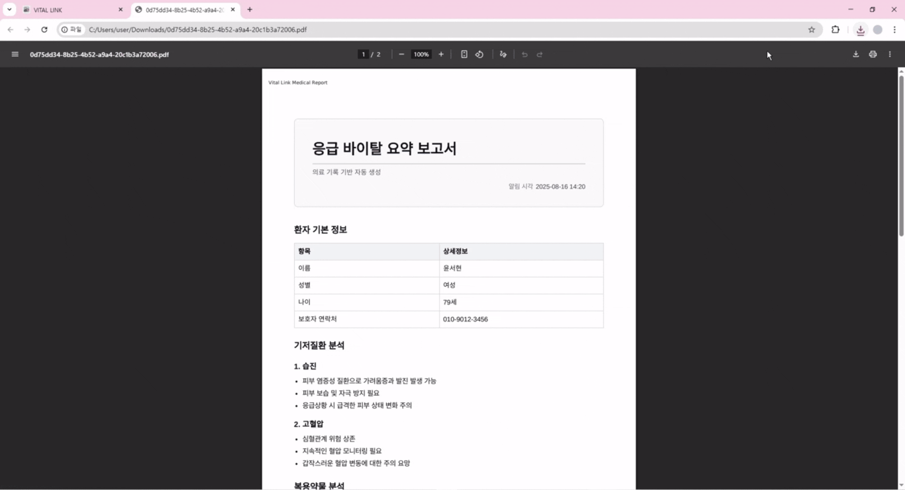
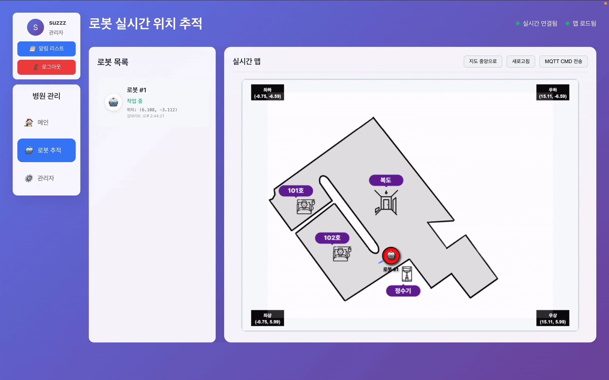

# 🧑‍🦳 VITAL LINK : AI기반 고령자 모니터링 시스템 👩‍🦳

## 💡 서비스 개요

**SSAFY 13기 공통 프로젝트**

**VITAL LINK**는 급속한 고령화 사회에서 요양 관리사의 부족 문제를 해소하고, 시니어분들의 안전한 생활을 보장하기 위해 개발된 **AI 기반 고령자 모니터링 시스템**입니다.  

본 서비스는 **웨어러블 센서와 환경 센서**, 그리고 **자율주행 로봇**을 결합하여 고령자의 **바이탈 신호, 위치, 행동 패턴**을 실시간으로 수집·분석합니다. 이를 통해 바이탈 이상·낙상·배회 등등 위험 상황을 조기에 탐지하고, 즉각적인 알림과 보고서를 생성하여 보호자 및 요양 관리사에게 전달합니다.  

## 📝 주요 기능

- **실시간 생체 모니터링**
  - 웨어러블 아대를 통해 심박수, 산소포화도, 피부온도, 걸음 수, 낙상 여부 등을 수집
  - AI 기반 분석으로 위험 징후를 조기 감지 및 알림 전송
  - 

- **실시간 위치 추적**
  - BLE iBeacon 신호 세기(RSSI) 기반 구역(Location) 판별
  - 환자의 현재 위치를 실시간 서버와 연동하여 관리
  - 

- **응급 보고서 자동 생성**
  - 이상 징후 발생 시 AI 서버가 위험 상태를 탐지
  - MCP 서버를 통해 환자 메타데이터·최근 바이탈·인수인계 기록을 조합
  - AI 에이전트(Claude 3.5 Haiku)가 자동으로 마크다운 보고서 생성 및 PDF 저장
  - 

- **야간 순찰 자동화**
  - 자율주행 로봇이 LiDAR + SLAM을 활용하여 실내 경로 탐색 및 순찰 수행
  - YOLO 기반 Person 객체 탐지로 배회(Wander) 및 낙상(Fallen) 상황 인식
  - 탐지 시 이벤트 및 이미지 자동 전송
  - 

## 🔧 기술 스택

📱 <strong>HW (센서/디바이스)</strong>

 

- **사용자 센서**
  - BLE iBeacon 기반 위치 추적 (RSSI)
  - I2C 기반 바이탈 수집: 심박, 산소포화도, 체온, 걸음 수, 낙상 감지
  - SNTP 시간 동기화
  - MQTT 실시간 데이터 전송
    
- **환경 센서**
  - ESP32 BLE iBeacon Anchor (Major/Minor + RSSI)
  - 온도·습도·조도·TVOC 센서 (ADC / GPIO / I2C)
  - 1초 주기 센서 데이터 MQTT 전송 (JSON 형식)

🤖 <strong>Orin Car (자율주행 로봇)</strong>

 
  
- **프레임워크**
  - ROS2 Humble / SLAM Toolbox / RF2O Laser Odometry / Nav2
    
- **경로 탐색**
  - Hybrid A* (SmacPlannerHybrid), Regulated Pure Pursuit (RPP)
    
- **ROS 노드**
  - LiDAR, RF2O, 모터 드라이버, MQTT, 웨이포인트 매니저
  - 위치 데이터 MQTT 전송

- **객체 탐지**
  - YOLOv8n 기반 Person 탐지
  - Aspect ratio 기반 낙상 판정

🧠 <strong>AI 추론</strong>

 
  
- **데이터**
  - 바이탈: 심박, SpO₂, 체온, 걸음 수  
  - 환경: 온도, 습도, 조도, TVOC  
  - 메타: 나이, 성별, 기저질환 (하루 1회 갱신)  
  - 오픈 데이터셋: [AI-Hub 독거노인 위험감지](https://www.aihub.or.kr/aihubdata/data/view.do?currMenu=115&topMenu=100&dataSetSn=71803)

- **모델**
  - LSTM Autoencoder (시계열 + 메타 데이터 결합)
  - Lazy Loading (window=30, step=1)
  - ROC-AUC 기반 임계값 선정 → 이상 탐지

- **알림 & 보고서**
  - AI 서버 → MCP 서버 이상 이벤트 전송 (POST)
  - MCP 서버: MySQL(`patient`, `handover`), InfluxDB 조회  
  - Claude 3.5 Haiku → 마크다운 보고서 생성 → PDF 저장

🌐 <strong>WEB</strong>

 
  
- **Front-end**
  - Vue 3 / vue-router / Pinia
  - Axios (API 통신)
  - Chart.js + vue-chartjs (데이터 시각화)
  - Konva + vue-konva (2D 그래픽, 맵 오버레이)

- **Back-end**
  - FastAPI / Django REST Framework
  - MQTT (Mosquitto + Paho MQTT)
    - QoS 0: 초단위 센서 데이터
    - QoS 2: 로봇 제어 명령
  - SSE (Server-Sent Events) → 실시간 데이터 전송
  - DB
    - MySQL (환자 메타 정보)
    - InfluxDB (센서 시계열, 2일 보관)

- **시각화**
  - Grafana + InfluxDB → 실시간 대시보드

☁️ <strong>INFRA</strong>

 
  
- **CI/CD**: Jenkins (커스텀 빌드 이미지)

- **배포/호스팅**
  - Nginx (정적 리소스 + 리버스 프록시)
  - Docker (Grafana / Spring Boot / InfluxDB / Mosquitto 컨테이너)
  - Vercel (프론트엔드 호스팅)
  - AWS EC2 (서버 호스팅)

## 🚀 데모/서비스 바로가기

- [VITAL LINK 바로가기](https://i13a107.p.ssafy.io/)

## 👥 Team Members
| Profile | Role | Position |
|---------|------|-----------|
| [이수정](https://www.notion.so/2325477005b0819eb723f58b9eec0c36) | Team Leader | PM, HW(Environment Device) |
| [김진구](https://www.notion.so/2325477005b0813bb3ecf25bcae9dd3a) | Developer | AI (Computer Vision)| 
| [오승연](https://www.notion.so/2325477005b081c587d1f80c19d3dd39) | Developer | AI (Inference,MCP)|
| [이권민](https://www.notion.so/2325477005b0812b8413ec80b23240df) | Developer | BE, FE, Infra  |
| [전유진](https://www.notion.so/2325477005b08180b43eed738a5c2411) | Developer | HW (User Device) |
| [진영호](https://www.notion.so/2325477005b081ab9399cfd87e57fd24) | Developer | HW (Autonomous Driving) |

